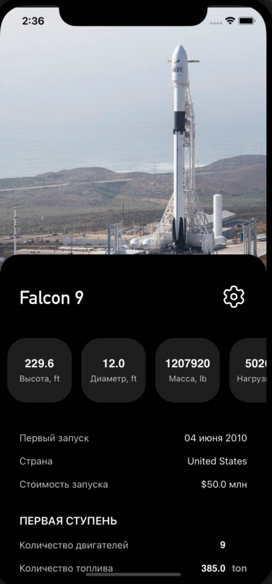
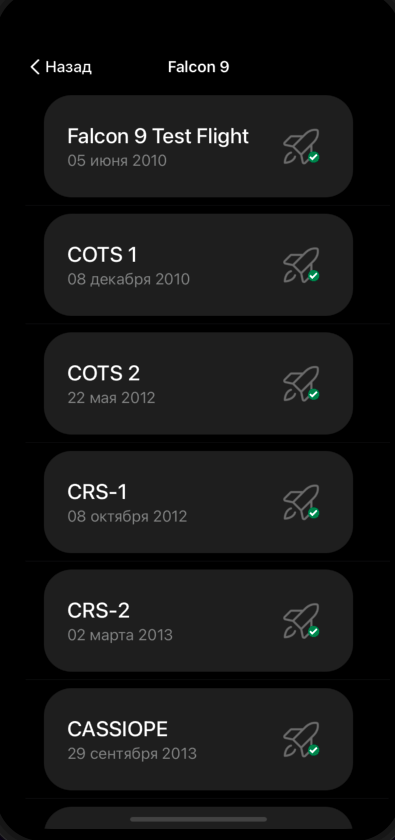
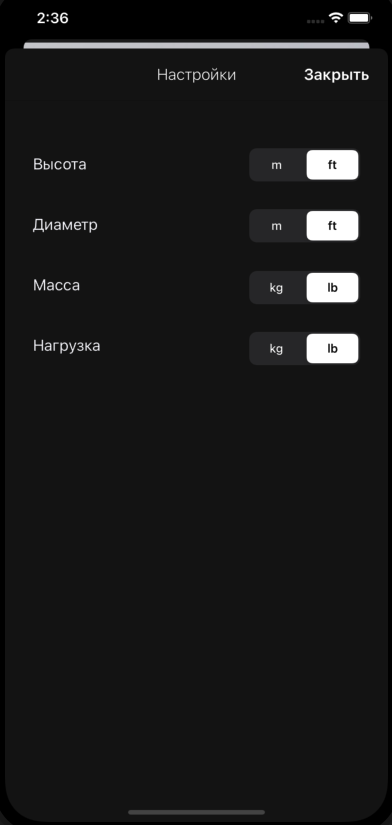

# Rocket project
Application display data for SpaceX rocket types, displays information about thier characteristics.

  
   
  

*  Main screen of application also display image of the rocket.
*  Second screen display launch information
*  Third screen display settings of application with unit measures

All information is requested from the SpaceX API server https://api.spacexdata.com/v4/
